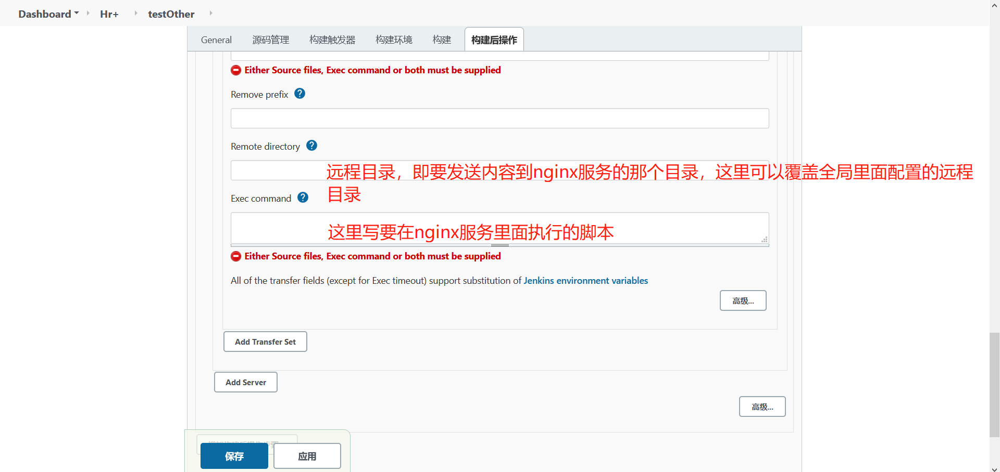

## Gitlab+Jenkins+Nginx部署前端项目

***准备：***
```
centos7环境三个分别安装：
gitlab(10.88.22.77)，jenkins(10.88.22.67)，nginx(10.1.245.101)
项目上传到gitlab
```
### Jenkins配置

> 部署Jenkins的系统需要安装git，这里安装位置在：/usr/local/gits

- [x] ***安装插件***
> 手动安装快些，[下载地址][1]，主要安装下面两个，其他的插件一般在安装jenkins时已经安装好了，有些插件不匹配需要将jenkins升级到最新版本

	构建时设置git参数：Build With Parameters
	
	构建后发布到服务器：Publish Over SSH


- [x] ***全局工具配置***

------


------
> **1、gitlab使用的git所在路径**


------
> **2、全局nodejs环境**


- [x] ***系统配置***

------


------
> **1、配置全局gitlab，可以配置也可以不配置**


------
> **1.1、获取gitlab用户的token，先看设置里的Account，没有就去Account Token里面新增一个**


------
> 1.2、**给全局gitlab添加凭证，点击`添加`，选择`jenkins`，添加好凭证会在旁边的下拉项出现，右边`Test Connection`测试下是否能链接成功**


> **2、配置publish over ssh，构建后发布到的nginx服务器，设置好可以点击`Test Connection`测试是否连接成功**


     ***上面配置的密码Passphrase，是针对下面所有的ssh servers，每个ssh servers都可以设置自己的密码***

------

     ***每个ssh servers都能在右下角【高级】中配置自己的密码***


------


### 添加构建任务
> 新建一个视图，选择视图新建Item，添加后直接进入配置页
#### 1、自由风格任务


------
> **`1、设置构建时选择的参数`**


     ***这里没有配置全局gitlab，所有下拉项没有选项***
     

------


------

	***这里填写是 名称:branshs，描述:分支，参数类型:分支，默认值:master***

------


------

	***这里填写的是 名称：environment，选项：test2 prod saas，描述：构建环境***

------
> **`2、源码管理配置`**


***添加凭证后会出现再下拉项，没有凭证时设置仓库地址会报错，选择一个凭证后就可以了***

------
> **`3、构建环境配置`**


------
> **`4、构建步骤`**


------


***这里填写如下，使用了参数配置中的环境变量草书`envrionment`：
`npm cache clean --force
npm install
rm -rf dist/*
npm run build:${envrionment}
`***

------
> **`5、构建后步骤`**



***这里填写如下：基础配置完成保存后可以使用
`Source files: dist/**
Remove prefix: dist/
Remote directory: /usr/local/nginx
Exec command: systemctl restart nginx
`***

> **`6、开始构建页面`**


[1]: http://updates.jenkins-ci.org/download/plugins/

